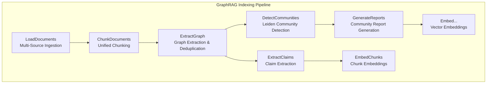

# GraphRAG Multi-Document Input Processing Architecture and Directory Structure

> 💡 **Paper Reference & Attribution**: This article is derived from an in-depth study, engineering analysis, and architectural interpretation of the Microsoft research paper [*From Local to Global: A Graph RAG Approach to Query-Focused Summarization*](https://arxiv.org/abs/2404.16130) (arXiv:2404.16130).

---

### 1. Overview

Microsoft GraphRAG treats an entire input directory as a **unified corpus** rather than isolated silos. Its core design philosophy is: **load all documents together, chunk uniformly, and build a unified knowledge graph**, enabling seamless cross-document entity linkage and knowledge synthesis. Multiple heterogeneous files are merged into a single `documents` DataFrame for downstream processing.

---

### 2. Implementation Architecture

#### 2.1 End-to-End Indexing Pipeline

The GraphRAG Indexing Pipeline is architected as a sequential workflow composed of modular phases:



This pipeline transforms raw unstructured documents into a queryable, hierarchical knowledge graph.

#### 2.2 Document Ingestion (Data Loading)

**Core Component**: The `graphrag-input` package provides an abstract base class `InputReader`, yielding documents via an asynchronous iterator (`__aiter__`) from local or cloud storage.

**Multi-Format Processing Matrix**:

| File Format | Processing Strategy |
|:---|:---|
| **TXT** | Each `.txt` file is ingested as an individual document |
| **CSV** | Each CSV row is parsed as a distinct document; multiple CSVs are merged into a unified DataFrame |
| **JSON / JSONL** | Parsed into structured document objects; JSONL processed line-by-line |
| **Parquet** | Read natively using PyArrow / Polars |

**Ingestion Steps**:
1. Match candidate files in the directory using the `file_pattern` regex (default: `.*\.txt$`).
2. Read file buffers and compute MD5 hashes as unique document identifiers.
3. Store filenames/paths in the `title` metadata attribute.
4. Assemble all documents into a centralized `documents` DataFrame.

#### 2.3 Text Chunking

Text chunking is a **rule-based preprocessing step that does not invoke LLMs**. The `create_base_text_units` workflow employs the `graphrag-chunking` engine to split documents into discrete "Text Units" (Chunks).

**Configuration Parameters** (configured in `settings.yaml`):

| Parameter | Description | Default Value |
|:---|:---|:---|
| `chunk_size` | Maximum token limit per text unit | `1200` Tokens |
| `chunk_overlap` | Token overlap between adjacent text units | `100-200` Tokens |

The chunking engine splits on sentence boundaries (such as periods and punctuation marks), accumulating sentences up to the `chunk_size` limit. **All documents across the entire directory are chunked in a unified pass**, establishing the groundwork for cross-document entity and relationship extraction.

#### 2.4 Knowledge Graph Extraction

This phase represents the most compute- and LLM-intensive step:

1. **Parallel Extraction**: Each text chunk is treated as an independent processing unit dispatched concurrently to the LLM.
2. **Entity & Relation Extraction**: The LLM extracts `(entity, relation, entity)` triplets along with descriptions and contextual evidence from each chunk.
3. **Cross-Document Entity Resolution**: Extracted entities across all chunks and documents are deduplicated and merged globally based on normalized entity titles (`title`). Even if an entity is referenced in different documents under different phrasings, it converges onto a **single, unified entity node**.

#### 2.5 Community Detection & Report Synthesis

1. **Community Partitioning**: Runs graph clustering algorithms (e.g., Leiden) over the global graph to segment nodes into modular communities.
2. **Community Reports**: Dispatches prompts to LLMs to generate structured executive summaries (Community Reports) for each detected community.

#### 2.6 Vector Embeddings

Generates dense vector embeddings for entities, relationships, text chunks, and community summaries to power hybrid and semantic search queries.

#### 2.7 Extensibility Framework (Providers & Factories)

GraphRAG utilizes the Factory Pattern for deep customization across subsystems:
- **Input Reader**: Support custom readers for PDF, Markdown, DOCX, or database streams.
- **Language Model**: Pluggable LLM and embedding adapters.
- **Cache**: File, Redis, or memory caching layers to prevent duplicate LLM calls.
- **Vector Store**: LanceDB, Qdrant, Chroma, PostgreSQL pgvector, or Azure AI Search.
- **Pipeline & Workflows**: Custom pipeline step injection.

---

### 3. Recommended Project Directory Structure

#### 3.1 Workspace Initialization

Initialize a standard GraphRAG project structure using the CLI:

```bash
graphrag init [--root PATH]
```

This interactive command scaffolds configuration files and default prompt templates.

#### 3.2 Standard Directory Layout

```
<project_root>/
├── .env                    # Environment variables (API keys, endpoints)
├── settings.yaml           # Primary pipeline configuration
├── input/                  # Raw document ingestion folder
│   ├── doc1.txt
│   ├── doc2.txt
│   ├── dataset.csv
│   └── subfolder/          # Supports recursive subdirectories
│       └── doc3.txt
├── prompts/                # LLM prompt templates
│   ├── entity_extraction.txt
│   ├── community_report.txt
│   └── ...
└── output/                 # GraphRAG index artifacts (Parquet format)
    ├── entities.parquet
    ├── relationships.parquet
    ├── communities.parquet
    └── ...
```

#### 3.3 Core Configuration (`settings.yaml`)

```yaml
input:
  type: file                           # Storage backend: file | memory | blob | cosmosdb
  file_pattern: ".*\\.(txt|csv|json)"  # File matching regex
  base_dir: "input"                    # Ingestion source directory

chunking:
  size: 1200                           # Chunk token budget
  overlap: 100                         # Overlap token count

embedding:
  model: "text-embedding-3-small"
  vector_store:
    type: "lancedb"
```

---

### 4. Incremental Update Mechanics

When new documents need to be added to an existing knowledge graph, use the `graphrag update` workflow:

1. **Delta Detection**: Scans and compares document MD5 hashes and titles to detect new, modified, or deleted files.
2. **Targeted Pipeline Execution**: Executes extraction only over newly introduced documents.
3. **Graph Reconciliation**: Merges incremental entities and relations into the existing global graph by matching entity identifiers.

> **Note**: While incremental updates work effectively for **additive** documents, full index reconstruction remains the most consistent approach when dealing with extensive document deletions or modifications.
