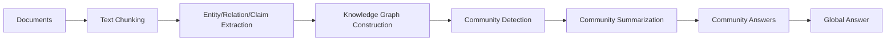
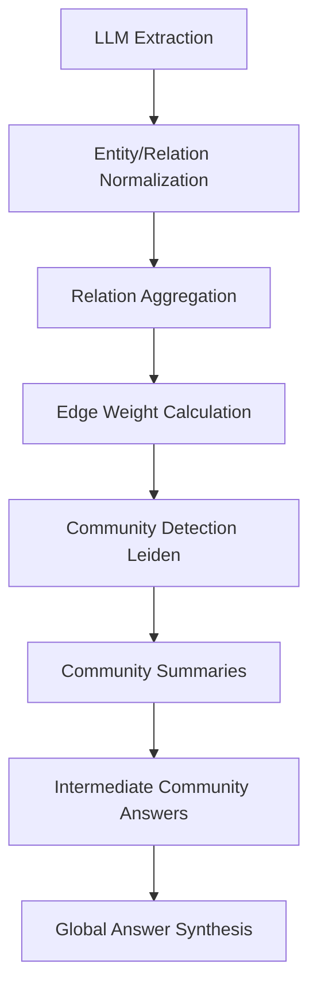

# GraphRAG PostgreSQL + TypeScript Implementation Design

> 💡 **Paper Reference & Attribution**: This article is derived from an in-depth study, engineering analysis, and architectural interpretation of the Microsoft research paper [*From Local to Global: A Graph RAG Approach to Query-Focused Summarization*](https://arxiv.org/abs/2404.16130) (arXiv:2404.16130).

> Objective: Translate the core workflow of Microsoft GraphRAG into a practical PostgreSQL + TypeScript technology stack, unifying "Community Summaries / Community Answers / Global Answers" and "Edge Weight Calculation" into an actionable, production-ready design specification.

---

## 1. Architecture Overview

The end-to-end GraphRAG execution pipeline can be summarized as follows:



From an engineering perspective, the two most critical implementation milestones are:

1. How graph data structures and relations are modeled and persisted in PostgreSQL.
2. How relation weights are computed and utilized in TypeScript.

---

## 2. The Concept of "Community" and Its Engineering Mapping

In the original GraphRAG paper, a "Community" is essentially:

- A cluster of densely interconnected graph nodes.
- Semantically cohesive and structurally tight.
- Capable of being summarized independently before being aggregated into a global answer.

In software architecture, this translates to:

```text
Graph Community
  = A group of Entity Nodes + Relation Edges + Associated Claims
  = A semantic topic module
  = An independently summarizable knowledge unit
```

Represented in TypeScript:

```ts
type Community = {
  id: string;
  level: number;
  nodeIds: string[];
  edgeIds: string[];
  claimIds: string[];
  summary?: string;
  parentCommunityId?: string;
  createdAt: Date;
};
```

---

## 3. Relation and Weight Calculation Mechanics

The GraphRAG paper explicitly highlights:

> In the final stage of knowledge graph extraction, entity/relation/claim instances are merged. Repeated instances of a relationship become the weight of graph edges, and claims are aggregated similarly.

This implies that GraphRAG edge weights represent **evidence frequency / connection strength**, rather than an arbitrary score predicted by a standalone ranking model.

### 3.1 Core Mathematical Formulation

Given two entities $u$ and $v$, with $R(u, v)$ denoting the set of extracted relation instances between them, the edge weight is defined as:

$$
weight(u, v) = \sum_{r \in R(u, v)} count(r)
$$

Where:

- $count(r)$ denotes the frequency of occurrence for relationship $r$ extracted across text chunks.
- $weight(u, v)$ signifies the empirical connection strength between entity $u$ and entity $v$.

### 3.2 Engineering Interpretation

If the extraction pipeline repeatedly discovers relationships such as:

- `A collaborates_with B`
- `A and B signed partnership`
- `A and B jointly launched project`
- `A works with B`

These semantically equivalent instances are normalized into a unified relation type (`collaborates_with`) and their occurrences are accumulated.

Thus, edge weight reflects:

- The number of times a factual link is corroborated across the corpus.
- The structural significance of the relation in the knowledge graph.
- A foundational driving signal for community detection algorithms (e.g., Leiden).

---

## 4. TypeScript Implementation: Edge Weight Calculation

```ts
type Entity = {
  id: string;
  name: string;
  description?: string;
};

type RelationInstance = {
  sourceEntityId: string;
  targetEntityId: string;
  relationType: string; // Normalized relation type, e.g., "collaborates_with"
  rawText: string;
  sourceDocId?: string;
  chunkId?: string;
};

type GraphEdge = {
  sourceEntityId: string;
  targetEntityId: string;
  relationType: string;
  weight: number;
  evidenceCount: number;
};

function normalizeRelationType(raw: string): string {
  // Normalize relation tokens: trim whitespace, lowercase, snake_case
  // E.g.: "works with" -> "works_with", "collaborates with" -> "collaborates_with"
  return raw
    .trim()
    .toLowerCase()
    .replace(/\s+/g, "_");
}

function buildEdgeWeights(
  relationInstances: RelationInstance[]
): GraphEdge[] {
  const map = new Map<string, GraphEdge>();

  for (const item of relationInstances) {
    const relationType = normalizeRelationType(item.relationType);
    const key = [item.sourceEntityId, item.targetEntityId, relationType].join("::");

    const existing = map.get(key);
    if (existing) {
      existing.weight += 1;
      existing.evidenceCount += 1;
    } else {
      map.set(key, {
        sourceEntityId: item.sourceEntityId,
        targetEntityId: item.targetEntityId,
        relationType,
        weight: 1,
        evidenceCount: 1,
      });
    }
  }

  return Array.from(map.values());
}
```

### Notes

- `weight` represents the cumulative corroboration count.
- This directly reflects the paper's principle of "extracted relations serving as edge weights".
- For enhanced robustness, `normalizeRelationType` can incorporate synonym dictionaries or embedding-based semantic canonicalization.

---

## 5. TypeScript Implementation: Graph Construction & Community Partitioning

```ts
type GraphNode = {
  id: string;
  label: string;
  description?: string;
};

type Graph = {
  nodes: GraphNode[];
  edges: GraphEdge[];
};

async function buildGraph(
  entityRecords: Entity[],
  relationInstances: RelationInstance[]
): Promise<Graph> {
  const nodes = entityRecords.map(e => ({
    id: e.id,
    label: e.name,
    description: e.description,
  }));

  const edges = buildEdgeWeights(relationInstances);

  return { nodes, edges };
}

function detectCommunities(graph: Graph): Community[] {
  // Execute hierarchical graph clustering (e.g., Leiden / Louvain algorithm)
  // Core concept: Cluster nodes driven by edge weights
  const communities: Community[] = [];

  // 1) Identify densely connected subgraphs according to connection weights
  // 2) Form modular community partitions
  // 3) Recursively subdivide into multi-level hierarchies

  return communities;
}
```

### Core Insight

- Greater edge weights indicate stronger semantic coupling between entities.
- Community detection algorithms prioritize clustering nodes linked by high-weight edges.
- This forms tightly scoped, semantically rich topic modules.

---

## 6. TypeScript Implementation: Community Summarization

```ts
type CommunitySummaryInput = {
  communityId: string;
  nodeIds: string[];
  edgeIds: string[];
  claimIds: string[];
};

async function summarizeCommunity(
  input: CommunitySummaryInput,
  context: string
): Promise<string> {
  const prompt = `
    You are a specialized knowledge graph community summarizer.
    Generate a concise yet comprehensive structured summary based on the entities, relations, and claims within this community.

    Community ID: ${input.communityId}
    Entities: ${input.nodeIds.join(", ")}
    Relations: ${input.edgeIds.join(", ")}
    Claims: ${input.claimIds.join(", ")}

    Background Context:
    ${context}
  `;

  return await llmCall(prompt);
}
```

Hierarchical alignment:
- **Leaf Communities**: Summaries synthesized directly from low-level entities, edges, and raw claims.
- **Higher-Level Communities**: Synthesized recursively from child community summaries.

---

## 7. TypeScript Implementation: Community Answers to Global Answer

```ts
type CommunityAnswer = {
  communityId: string;
  answer: string;
  usefulnessScore: number; // 0 to 100
};

async function generateCommunityAnswer(
  query: string,
  communitySummary: string
): Promise<CommunityAnswer> {
  const prompt = `
    User Query: ${query}
    Community Summary:
    ${communitySummary}

    Answer the query based on the summary and provide a usefulness score (0-100) indicating how relevant this community summary is to answering the query.
    Output Format (JSON):
    {
      "answer": "...",
      "usefulnessScore": 88
    }
  `;

  const raw = await llmCall(prompt);
  const result = JSON.parse(raw);

  return {
    communityId: "",
    answer: result.answer,
    usefulnessScore: Number(result.usefulnessScore ?? 0),
  };
}

async function generateGlobalAnswer(
  query: string,
  communityAnswers: CommunityAnswer[]
): Promise<string> {
  const ranked = communityAnswers
    .filter(x => x.usefulnessScore > 0)
    .sort((a, b) => b.usefulnessScore - a.usefulnessScore);

  const context = ranked
    .map(x => x.answer)
    .join("\n\n");

  const prompt = `
    User Query: ${query}
    Reference Candidate Answers:
    ${context}

    Synthesize the candidate answers above into a comprehensive, coherent final global response.
  `;

  return await llmCall(prompt);
}
```

---

## 8. PostgreSQL Schema Design (DDL)

### 8.1 Core Tables

```sql
CREATE TABLE entities (
  id UUID PRIMARY KEY,
  name TEXT NOT NULL,
  description TEXT,
  created_at TIMESTAMPTZ DEFAULT NOW()
);

CREATE TABLE relation_instances (
  id UUID PRIMARY KEY,
  source_entity_id UUID NOT NULL REFERENCES entities(id),
  target_entity_id UUID NOT NULL REFERENCES entities(id),
  relation_type TEXT NOT NULL,
  raw_text TEXT NOT NULL,
  source_doc_id TEXT,
  chunk_id TEXT,
  created_at TIMESTAMPTZ DEFAULT NOW()
);

CREATE TABLE graph_edges (
  id UUID PRIMARY KEY,
  source_entity_id UUID NOT NULL REFERENCES entities(id),
  target_entity_id UUID NOT NULL REFERENCES entities(id),
  relation_type TEXT NOT NULL,
  weight INTEGER NOT NULL DEFAULT 1,
  evidence_count INTEGER NOT NULL DEFAULT 1,
  created_at TIMESTAMPTZ DEFAULT NOW()
);

CREATE TABLE communities (
  id UUID PRIMARY KEY,
  parent_community_id UUID REFERENCES communities(id),
  level INTEGER NOT NULL,
  summary TEXT,
  created_at TIMESTAMPTZ DEFAULT NOW()
);

CREATE TABLE community_members (
  id UUID PRIMARY KEY,
  community_id UUID NOT NULL REFERENCES communities(id),
  entity_id UUID NOT NULL REFERENCES entities(id),
  created_at TIMESTAMPTZ DEFAULT NOW()
);
```

### 8.2 Edge Weight Aggregation SQL

```sql
WITH normalized AS (
  SELECT
    source_entity_id,
    target_entity_id,
    LOWER(REGEXP_REPLACE(relation_type, '\\s+', '_', 'g')) AS relation_type
  FROM relation_instances
)
SELECT
  source_entity_id,
  target_entity_id,
  relation_type,
  COUNT(*) AS weight,
  COUNT(*) AS evidence_count
FROM normalized
GROUP BY source_entity_id, target_entity_id, relation_type;
```

This SQL query delivers the exact database implementation of "corroborated relation frequency = graph edge weight".

---

## 9. Key Engineering Takeaways

### 9.1 Why Weights Are Stored as Discrete Counts

GraphRAG relies on empirical occurrence counts across extracted chunks rather than complex machine-learned regression scores. Thus, leveraging relational database `COUNT(*)` aggregations provides high performance, complete auditability, and direct compatibility with graph partitioning algorithms.

### 9.2 Why Community Detection Relies on Weights

Community detection algorithms require weighted topology to discern:
- Which entity pairs exhibit strong mutual affinity.
- Which node clusters form cohesive thematic modules.
- Which edges bridge distinct communities versus strengthen internal cohesion.

High-weight connections guide algorithms to assemble precise, information-dense topic partitions.

---

## 10. Summary

The end-to-end GraphRAG pipeline is organized across these core layers:



Key principles:
- Graph edge weights originate from normalized instance frequency counts.
- Weighted graphs drive hierarchical community detection.
- Communities are summarized into thematic reports.
- Global queries map across communities to synthesize robust, macro-level answers.
