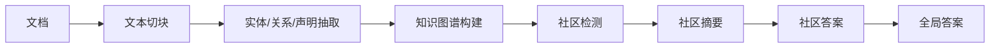
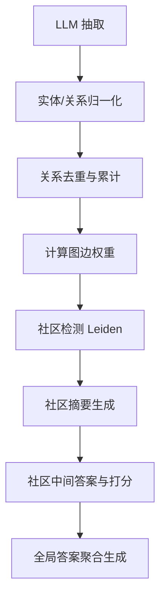

# GraphRAG PostgreSQL + TypeScript 实现设计

> 💡 **论文解读与参考来源**：本文内容基于对微软论文 [*From Local to Global: A Graph RAG Approach to Query-Focused Summarization*](https://arxiv.org/abs/2404.16130) (arXiv:2404.16130) 的深入研读、工程实践与架构解读。

> 目标：将 GraphRAG 的核心流程落到 PostgreSQL + TypeScript 技术栈中，并把“社区摘要 / 社区答案 / 全局答案”以及“边权重计算”统一整理为一份可实现的设计说明。

---

## 1. 设计总览

GraphRAG 的主链路可以概括为：



其中最关键的两个工程点是：

1. 图数据如何落到 PostgreSQL 中
2. 如何用 TypeScript 计算和使用权重（weights）

---

## 2. 社区的概念与工程对应

论文中的“社区”本质上是：

- 一组高度连接的图节点
- 语义上相近，结构上紧密
- 可以独立生成摘要，再汇总到全局答案

工程上，可以理解为：

```text
Graph Community
  = 一组实体节点 + 关系边 + 相关声明
  = 一个语义主题模块
  = 可被独立摘要的知识单元
```

对应到 TS 类型大致如下：

```ts
type Community = {
  id: string;
  level: number;
  nodeIds: string[];
  edgeIds: string[];
  claimIds: string[];
  summary?: string;
  parentCommunityId?: string;
  createdAt: Date;
};
```

---

## 3. 关系与权重的计算方式

论文中明确指出：

> 在知识图谱提取的最终阶段，实体/关系/声明实例被合并，关系的重复实例会形成图边的权重，声明的汇总方式类似。

这意味着 GraphRAG 的权重更像是“事实频次/连接强度”，而不是某个独立训练模型输出的分数。

### 3.1 基本公式

设两个实体为 $u$ 和 $v$，关系实例集合为 $R(u, v)$，则边权重为：

$$
weight(u, v) = \sum_{r \in R(u, v)} count(r)
$$

其中：

- $count(r)$ 表示该关系被抽取到的重复次数
- $weight(u, v)$ 表示 $u$ 和 $v$ 之间的连接强度

### 3.2 工程上如何解释

如果系统在多个文档中重复抽取到以下关系：

- A collaborates_with B
- A and B signed partnership
- A and B jointly launched project
- A works with B

那么这些语义等价的实例会统一归并成同一条关系类型，再累计出现次数。

因此，边权重可以理解为：

- 事实被重复确认的次数
- 关系在知识图中的强度
- 社区检测时的重要信号

---

## 4. 伪代码：权重计算

```ts
type Entity = {
  id: string;
  name: string;
  description?: string;
};

type RelationInstance = {
  sourceEntityId: string;
  targetEntityId: string;
  relationType: string; // 归一化后的关系类型，如 "collaborates_with"
  rawText: string;
  sourceDocId?: string;
  chunkId?: string;
};

type GraphEdge = {
  sourceEntityId: string;
  targetEntityId: string;
  relationType: string;
  weight: number;
  evidenceCount: number;
};

function normalizeRelationType(raw: string): string {
  // 伪代码：做关系归一化
  // 例："works with" -> "works_with"
  //     "合作" -> "collaborates_with"
  return raw
    .trim()
    .toLowerCase()
    .replace(/\s+/g, "_");
}

function buildEdgeWeights(
  relationInstances: RelationInstance[]
): GraphEdge[] {
  const map = new Map<string, GraphEdge>();

  for (const item of relationInstances) {
    const relationType = normalizeRelationType(item.relationType);
    const key = [item.sourceEntityId, item.targetEntityId, relationType].join("::");

    const existing = map.get(key);
    if (existing) {
      existing.weight += 1;
      existing.evidenceCount += 1;
    } else {
      map.set(key, {
        sourceEntityId: item.sourceEntityId,
        targetEntityId: item.targetEntityId,
        relationType,
        weight: 1,
        evidenceCount: 1,
      });
    }
  }

  return Array.from(map.values());
}
```

### 说明

- 这里的 `weight` 是“累计出现次数”
- 这就是论文中 “给定的关系成为边权重” 的工程含义
- 如果需要更稳健，可以在 `normalizeRelationType` 中加入 synonym map 或 embedding-based alias merge

---

## 5. 伪代码：图谱构建与社区切分

```ts
type GraphNode = {
  id: string;
  label: string;
  description?: string;
};

type Graph = {
  nodes: GraphNode[];
  edges: GraphEdge[];
};

async function buildGraph(
  entityRecords: Entity[],
  relationInstances: RelationInstance[]
): Promise<Graph> {
  const nodes = entityRecords.map(e => ({
    id: e.id,
    label: e.name,
    description: e.description,
  }));

  const edges = buildEdgeWeights(relationInstances);

  return { nodes, edges };
}

function detectCommunities(graph: Graph): Community[] {
  // 伪代码：调用 Leiden / Louvain / 自定义图分割算法
  // 核心思想：利用边权重驱动社区检测

  const communities: Community[] = [];

  // 1) 根据图的连接强度找出高内聚子图
  // 2) 形成多个社区
  // 3) 可递归再细分

  return communities;
}
```

### 核心思想

- 边权重越大，说明两个实体之间的联系越强
- 社区检测算法会优先把高权重连接的节点放到同一社区
- 这样形成的是“语义上更集中、结构上更紧密”的主题团块

---

## 6. 伪代码：社区摘要生成

```ts
type CommunitySummaryInput = {
  communityId: string;
  nodeIds: string[];
  edgeIds: string[];
  claimIds: string[];
};

async function summarizeCommunity(
  input: CommunitySummaryInput,
  context: string
): Promise<string> {
  const prompt = `
    你是社区总结器。
    请根据以下图社区中的节点、关系、声明，生成一个简洁但完整的摘要。

    社区ID: ${input.communityId}
    节点: ${input.nodeIds.join(", ")}
    关系: ${input.edgeIds.join(", ")}
    声明: ${input.claimIds.join(", ")}

    背景信息:
    ${context}
  `;

  return await llmCall(prompt);
}
```

与论文对应：

- 叶子社区：基于更低层的节点/边/声明做摘要
- 上层社区：基于下层社区摘要进一步概括

---

## 7. 伪代码：社区答案与最终答案

```ts
type CommunityAnswer = {
  communityId: string;
  answer: string;
  usefulnessScore: number; // 0~100
};

async function generateCommunityAnswer(
  query: string,
  communitySummary: string
): Promise<CommunityAnswer> {
  const prompt = `
    用户问题: ${query}
    社区摘要:
    ${communitySummary}

    请回答这个问题，并给出一个 0~100 的有用性分数，说明该社区总结对问题有多大帮助。
    输出格式：
    {
      "answer": "...",
      "usefulnessScore": 88
    }
  `;

  const raw = await llmCall(prompt);
  const result = JSON.parse(raw);

  return {
    communityId: "",
    answer: result.answer,
    usefulnessScore: Number(result.usefulnessScore ?? 0),
  };
}

async function generateGlobalAnswer(
  query: string,
  communityAnswers: CommunityAnswer[]
): Promise<string> {
  const ranked = communityAnswers
    .filter(x => x.usefulnessScore > 0)
    .sort((a, b) => b.usefulnessScore - a.usefulnessScore);

  const context = ranked
    .map(x => x.answer)
    .join("\n\n");

  const prompt = `
    用户问题: ${query}
    参考答案片段:
    ${context}

    请根据以上信息给出最终答案。
  `;

  return await llmCall(prompt);
}
```

---

## 8. PostgreSQL 中的落库设计

### 8.1 核心表

```sql
CREATE TABLE entities (
  id UUID PRIMARY KEY,
  name TEXT NOT NULL,
  description TEXT,
  created_at TIMESTAMPTZ DEFAULT NOW()
);

CREATE TABLE relation_instances (
  id UUID PRIMARY KEY,
  source_entity_id UUID NOT NULL REFERENCES entities(id),
  target_entity_id UUID NOT NULL REFERENCES entities(id),
  relation_type TEXT NOT NULL,
  raw_text TEXT NOT NULL,
  source_doc_id TEXT,
  chunk_id TEXT,
  created_at TIMESTAMPTZ DEFAULT NOW()
);

CREATE TABLE graph_edges (
  id UUID PRIMARY KEY,
  source_entity_id UUID NOT NULL REFERENCES entities(id),
  target_entity_id UUID NOT NULL REFERENCES entities(id),
  relation_type TEXT NOT NULL,
  weight INTEGER NOT NULL DEFAULT 1,
  evidence_count INTEGER NOT NULL DEFAULT 1,
  created_at TIMESTAMPTZ DEFAULT NOW()
);

CREATE TABLE communities (
  id UUID PRIMARY KEY,
  parent_community_id UUID REFERENCES communities(id),
  level INTEGER NOT NULL,
  summary TEXT,
  created_at TIMESTAMPTZ DEFAULT NOW()
);

CREATE TABLE community_members (
  id UUID PRIMARY KEY,
  community_id UUID NOT NULL REFERENCES communities(id),
  entity_id UUID NOT NULL REFERENCES entities(id),
  created_at TIMESTAMPTZ DEFAULT NOW()
);
```

### 8.2 权重聚合 SQL

```sql
WITH normalized AS (
  SELECT
    source_entity_id,
    target_entity_id,
    LOWER(REGEXP_REPLACE(relation_type, '\\s+', '_', 'g')) AS relation_type
  FROM relation_instances
)
SELECT
  source_entity_id,
  target_entity_id,
  relation_type,
  COUNT(*) AS weight,
  COUNT(*) AS evidence_count
FROM normalized
GROUP BY source_entity_id, target_entity_id, relation_type;
```

这就是工程上的“重复关系累计 = 权重”实现。

---

## 9. 实现时的关键设计判断

### 9.1 为什么不用直接把“权重”存成复杂数学值

因为论文里描述的是“重复频次累加”，而不是对每个关系做高阶学习评分。

所以更适合在数据库中使用：

- `COUNT(*)` 统计重复次数
- 作为图边权重
- 再交给社区检测算法使用

### 9.2 为什么社区检测依赖权重

因为社区检测需要知道：

- 哪些节点更强地相连
- 哪些节点属于同一个主题簇
- 哪些边对整体图结构更重要

只要边权重足够强，这些节点自然会被归到一个社区中。

---

## 10. 设计总结

GraphRAG 的实现可以被拆成以下关键层：



最关键的工程事实是：

- GraphRAG 的权重来自“重复事实累计”而非单个评分模型
- 边权重用于决定图中哪些节点更密切相关
- 这些强连接节点会被归位到社区中
- 社区再被写成摘要，最终服务于查询回答

---

## 11. 一句话总括

> GraphRAG 的实体/关系权重，本质上是“同类型关系被重复抽取并归一化后的累计次数”；在 PostgreSQL 中可直接以 `COUNT(*)` 聚合实现，在 TypeScript 中由抽取、归一化、聚合和社区检测共同驱动，最后用于生成社区摘要和全局答案。

如果你愿意，我下一步可以继续把这份文档再细化成：

1. PostgreSQL 表结构 + SQL DDL
2. TypeScript 接口和业务流程代码
3. 一个完整的 GraphRAG 实现路线图（从抽取到查询）

这样就可以直接开始编码。