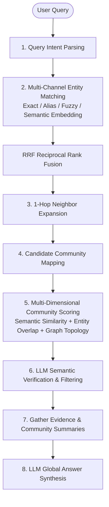
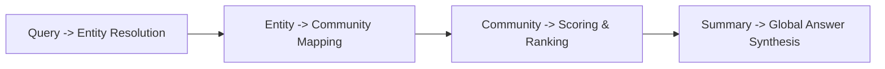

# GraphRAG Retrieval Implementation Guide

> 💡 **Paper Reference & Attribution**: This article is derived from an in-depth study, engineering analysis, and architectural interpretation of the Microsoft research paper [*From Local to Global: A Graph RAG Approach to Query-Focused Summarization*](https://arxiv.org/abs/2404.16130) (arXiv:2404.16130).

---

## 1. Objectives

Once the GraphRAG knowledge graph and community hierarchy have been built, the retrieval phase does not rebuild the graph. Instead, it leverages precomputed graph indices, community hierarchies, and summaries to perform:

- Query intent parsing
- Multi-channel entity and alias matching
- Community candidate recall
- Multi-dimensional community scoring & ranking
- Contextual evidence gathering
- Final answer synthesis

The retrieval pipeline operates strictly over pre-indexed artifacts without re-extracting entities or re-clustering graphs at query time.

---

## 2. Ingested Data Artifacts for Retrieval

A built GraphRAG instance typically exposes the following structured data entities:

- `entities`: Canonical entity registry
- `entity_aliases`: Synonym and alias mapping
- `edges`: Weighted relationship links between entities
- `communities`: Hierarchical community nodes
- `community_members`: Entity-to-community membership tables
- `community_summaries`: Pre-generated thematic summaries per community
- `claims`: Factual claims, assertions, and supporting evidence snippets

---

## 3. End-to-End Retrieval Pipeline

GraphRAG retrieval operates as a hybrid pipeline combining deterministic algorithmic scoring with LLM-powered semantic augmentation.



### 3.1 Query Intent Parsing

Upon receiving a user query, the pipeline extracts key signals:

- Target named entities
- Aliases and abbreviations
- Thematic topics and sentiment/temporal scope

For example:
```text
Query: "What is the historical background of collaboration between Organization A and Company B?"
```

Extracted signals:
- **Entities**: Organization A, Company B
- **Themes**: Partnership history, joint ventures, background timeline

### 3.2 Multi-Channel Entity Matching & RRF Fusion

Candidate entities are retrieved across multiple channels:

1. **Exact Match**: Direct string comparison against entity names.
2. **Alias Match**: Mapping abbreviations and alternative naming.
3. **Fuzzy Match**: Trigram / Levenshtein similarity.
4. **Semantic Match**: Vector cosine similarity over entity embeddings.

The multi-channel candidate lists are merged using **Reciprocal Rank Fusion (RRF)** to produce a unified, confidence-ranked entity set:

$$
E_q = \{e_1, e_2, \dots, e_n\}
$$

### 3.3 1-Hop Neighbor Expansion

Starting from the matched entity set $E_q$, expand to 1-hop graph neighbors:

$$
N(E_q) = \{v \mid \exists e \in E_q, (e, v) \in E\}
$$

Where $E$ represents the set of weighted edges. This broadens retrieval from explicit keyword mentions to semantically and structurally relevant contextual entities.

### 3.4 Community Candidate Mapping

Map the expanded entity pool back into community memberships:

$$
C_q = \{c \mid E_c \cap (E_q \cup N(E_q)) \neq \emptyset\}
$$

Where $E_c$ is the entity set belonging to community $c$, and $C_q$ represents the candidate community set.

### 3.5 Multi-Dimensional Community Scoring & Ranking

Candidate communities are scored and ranked to select the Top-$K$ relevant partitions:

#### Option 1: Weighted Linear Combination
$$
Score(q, C) = \alpha \cdot Sim(q, Summary(C)) + \beta \cdot EntityOverlap(q, C) + \gamma \cdot StructuralScore(q, C)
$$

Where:
- $Sim(q, Summary(C))$: Cosine similarity between query embedding and community summary.
- $EntityOverlap(q, C)$: Jaccard overlap between query entities and community member entities.
- $StructuralScore(q, C)$: Cumulative graph edge weight and neighbor density.
- $\alpha, \beta, \gamma$: Configurable weighting coefficients.

#### Option 2: Dimension-Agnostic Reciprocal Rank Fusion (RRF)
When combining signals with vastly different scales (e.g. cosine similarity vs integer degree counts), calculate independent rank orders across each signal and fuse them using RRF:

$$
Score_{RRF}(C) = \frac{1}{k + rank_{semantic}(C)} + \frac{1}{k + rank_{overlap}(C)} + \frac{1}{k + rank_{structure}(C)}
$$

### 3.6 LLM Semantic Re-Ranking & Filtering

Top candidate communities undergo an LLM verification step:
- Discard superficially related but irrelevant communities.
- Filter out noise and identify the high-confidence thematic clusters.

### 3.7 Evidence Marshalling & Answer Generation

Top-$K$ communities return comprehensive context:
- Executive community summaries
- Member entities and relationship paths
- Factual claims and grounded document snippets

The LLM synthesizes this structured context into a coherent global response.

---

## 4. Key Mathematical Formulas

### 4.1 Edge Weight Formula
$$
weight(u, v) = \sum_{r \in R(u, v)} count(r)
$$

### 4.2 Entity Overlap Ratio
$$
EntityOverlap(q, C) = \frac{|E_q \cap E_C|}{|E_q \cup E_C|}
$$

### 4.3 Structural Graph Score
$$
StructuralScore(q, C) = \sum_{e \in E_q} \sum_{v \in E_C} weight(e, v)
$$

### 4.4 Reciprocal Rank Fusion (RRF)
$$
RRF\_Score(d) = \sum_{m \in M} \frac{1}{k + r_m(d)}
$$
*(Where $M$ is the set of ranking channels, $r_m(d)$ is the 1-based rank, and $k \approx 60$ is the smoothing constant).*

---

## 5. TypeScript Reference Implementation

```typescript
type Edge = {
  sourceEntityId: string;
  targetEntityId: string;
  relationType: string;
};

type AggregatedEdge = {
  sourceEntityId: string;
  targetEntityId: string;
  relationType: string;
  weight: number;
};

function aggregateEdges(edges: Edge[]): AggregatedEdge[] {
  const map = new Map<string, AggregatedEdge>();
  for (const item of edges) {
    const key = `${item.sourceEntityId}::${item.targetEntityId}::${item.relationType}`;
    const existing = map.get(key);
    if (existing) {
      existing.weight += 1;
    } else {
      map.set(key, {
        sourceEntityId: item.sourceEntityId,
        targetEntityId: item.targetEntityId,
        relationType: item.relationType,
        weight: 1,
      });
    }
  }
  return Array.from(map.values());
}

function scoreCommunity(
  query: string,
  communitySummary: string,
  entityNames: string[],
  similarityFn: (a: string, b: string) => number
): number {
  const semanticScore = similarityFn(query, communitySummary);
  const entityScore = entityNames.reduce(
    (sum, entity) => sum + similarityFn(query, entity),
    0
  );
  return semanticScore + 0.5 * entityScore;
}

function reciprocalRankFusion<T>(
  rankedLists: T[][],
  getId: (item: T) => string,
  k = 60
): Array<{ item: T; score: number }> {
  const scoreMap = new Map<string, { item: T; score: number }>();

  for (const list of rankedLists) {
    list.forEach((item, index) => {
      const id = getId(item);
      const rank = index + 1;
      const current = scoreMap.get(id);
      const rrfScore = 1 / (k + rank);

      if (current) {
        current.score += rrfScore;
      } else {
        scoreMap.set(id, { item, score: rrfScore });
      }
    });
  }

  return Array.from(scoreMap.values()).sort((a, b) => b.score - a.score);
}
```

---

## 6. Practical Execution Roadmap



1. **Query -> Entity Resolution**: Perform multi-channel matching (exact, fuzzy, semantic embedding).
2. **Entity -> Community Mapping**: Expand 1-hop neighbors and map nodes to community partitions.
3. **Community -> Scoring & Ranking**: Score candidate communities using semantic similarity and graph topology via RRF.
4. **Summary -> Global Answer Synthesis**: Consolidate community summaries into the LLM context window to generate the final response.
