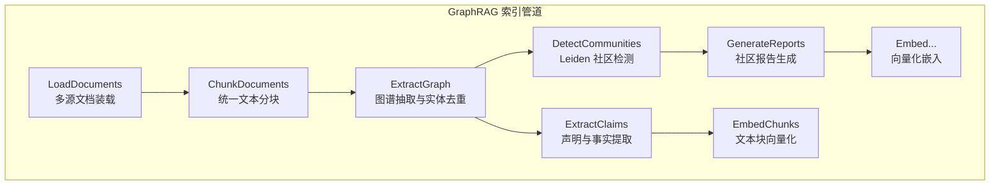

# GraphRAG 多文件输入处理架构与目录结构

> 💡 **论文解读与参考来源**：本文内容基于对微软论文 [*From Local to Global: A Graph RAG Approach to Query-Focused Summarization*](https://arxiv.org/abs/2404.16130) (arXiv:2404.16130) 的深入研读、工程实践与架构解读。

---

### 一、概述

微软 GraphRAG 将整个输入目录视为一个**有机整体**进行统一处理。其核心设计理念是：**将所有文档统一装载、统一分块、统一构建知识图谱**，从而实现跨文档的实体关联与知识融合。多个文件会被合并为一个最终的 `documents` DataFrame 进行后续处理。


### 二、实现架构

#### 2.1 整体索引管道

GraphRAG 的索引管道（Indexing Pipeline）采用顺序工作流（Workflow）设计，核心流程如下：



这一管道将原始文档转换为具有层次化社区结构的可查询知识图谱。

#### 2.2 数据装载（Document Loading）

**核心组件**：`graphrag-input` 包提供了 `InputReader` 抽象基类，通过异步迭代器 `__aiter__` 逐个从存储中加载文档。

**多文件处理机制**：

| 文件类型 | 处理方式 |
|:---|:---|
| **TXT** | 每个 `.txt` 文件作为一个独立文档读取 |
| **CSV** | 每个 CSV 行作为一个独立文档；多个 CSV 文件合并为一个 DataFrame |
| **JSON / JSONL** | 解析 JSON 结构为文档对象；JSONL 逐行解析 |
| **Parquet** | 使用 PyArrow 读取 |

**关键处理步骤**：
1. 根据 `file_pattern` 正则表达式（默认 `.*\.txt$`）匹配目录中的文件
2. 读取文件内容并生成 MD5 哈希作为唯一标识
3. 将文件名存入 `title` 字段
4. 所有文件组织为统一的 `documents` DataFrame

#### 2.3 文本分块（Chunking）

分块是**基于规则的预处理步骤，不直接调用 LLM**。`create_base_text_units` 工作流使用 `graphrag-chunking` 包将文档切分为"文本单元"（Text Units / Chunks）。

**核心参数**（在 `settings.yaml` 中配置）：

| 参数 | 说明 | 默认值 |
|:---|:---|:---|
| `chunk_size` | 每个文本块的最大词元数 | `1200` Tokens |
| `chunk_overlap` | 相邻块之间的重叠词元数 | `100-200` Tokens |

分块逻辑是按句子边界（如句号）拆分，不断组合句子直到达到 `chunk_size` 限制。**所有文档的文本内容会被统一分块**，分块过程跨文档进行，为后续跨文档的实体和关系提取奠定基础。

#### 2.4 图谱提取（Graph Extraction）

这是计算和 LLM 调用最密集的环节：

1. **并行处理**：每个文本块作为独立处理单元，**并行地**发送给 LLM
2. **实体与关系提取**：为每个文本块调用 LLM，提取 `(实体, 关系, 实体)` 三元组
3. **跨文档关联**：所有块中抽取的实体，依据其名称（`title`）进行**全局合并与去重**——即使同一实体出现在不同文档或不同块中，最终也会被识别为**同一个实体节点**

#### 2.5 社区检测与报告生成

1. **社区检测**：基于构建的全局图谱运行 Leiden 等社区检测算法，将图谱划分为关系紧密的"社区"
2. **报告生成**：为每个社区调用 LLM 生成社区摘要报告（Community Report）

#### 2.6 向量化（Embedding）

为实体、关系、社区报告等关键数据生成向量嵌入（Embeddings），支持语义搜索。

#### 2.7 扩展机制（Providers & Factories）

GraphRAG 采用工厂模式（Factory Pattern）支持深度定制，可自定义的子系统包括：
- **Input Reader**：自定义输入文档读取器，支持 TXT/CSV/JSON 以外的文件类型
- **Language Model**：自定义 Chat/Embed 模型
- **Cache**：自定义缓存存储
- **Vector Store**：自定义向量数据库
- **Pipeline + Workflows**：自定义工作流步骤


### 三、推荐的目录结构

#### 3.1 初始化命令

通过 `graphrag init` 命令自动生成标准项目结构：

```bash
graphrag init [--root PATH]
```

该命令会交互式地提示选择默认的 Chat/Completion 模型和 Embedding 模型。

#### 3.2 标准目录结构

```
<project_root>/
├── .env                    # 环境变量（API Keys 等敏感信息）
├── settings.yaml           # 主配置文件
├── input/                  # 源文档存放目录
│   ├── doc1.txt
│   ├── doc2.txt
│   ├── data.csv
│   └── subfolder/          # 支持嵌套子目录
│       └── doc3.txt
├── prompts/                # LLM Prompt 模板目录
│   ├── entity_extraction.txt
│   ├── community_report.txt
│   └── ...
└── output/                 # GraphRAG 索引输出目录
    ├── entities.parquet
    ├── relationships.parquet
    ├── communities.parquet
    └── ...
```

#### 3.3 关键配置文件说明

**`.env` 文件**：
```
GRAPHRAG_API_KEY=<YOUR_API_KEY>
```

**`settings.yaml` 文件**（核心配置）：

```yaml
input:
  type: file                    # 存储类型: file|memory|blob|cosmosdb
  file_pattern: ".*\\.(txt|csv|json)"  # 文件匹配正则
  base_dir: "input"             # 输入目录路径

chunking:
  size: 1200                    # 分块大小（Tokens）
  overlap: 100                  # 分块重叠大小

embedding:
  model: "text-embedding-3-small"
  vector_store:
    type: "lancedb"
```

### 四、增量更新机制

当需要向已有索引中添加新文档时，可使用 `graphrag update` 命令：

1. **差异检测**：通过比较文档的 `title` 字段，识别新增文档和已删除文档
2. **定向处理**：仅对新增文档运行完整的索引工作流
3. **图谱合并**：将增量实体/关系与旧图谱进行基于 `title` 的匹配与合并

> **注意**：增量更新主要针对**新增**文档，对于**修改或删除**文档，目前更稳健的做法仍是**全量重建索引**。