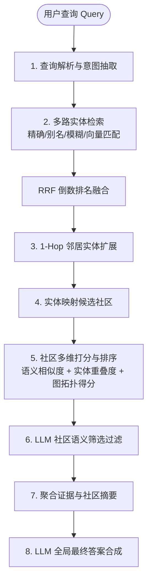
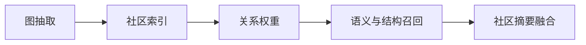

# GraphRAG 检索实现说明

> 💡 **论文解读与参考来源**：本文内容基于对微软论文 [*From Local to Global: A Graph RAG Approach to Query-Focused Summarization*](https://arxiv.org/abs/2404.16130) (arXiv:2404.16130) 的深入研读、工程实践与架构解读。

---

## 1. 目标

已完成 GraphRAG 构建后，检索阶段的核心目标不是重新构建图，而是根据已生成的图谱、社区和摘要，完成：

- 查询解析
- 实体/别名匹配
- 社区召回
- 社区排序
- 相关证据回传
- 最终答案生成

也就是说，检索阶段只依赖已构建出的索引对象，而不重复执行实体抽取和社区构建。

---

## 2. 检索的输入数据

在已构建好的 GraphRAG 中，通常至少存在以下数据：

- `entities`：实体表
- `entity_aliases`：实体别名表
- `edges`：关系边与权重
- `communities`：社区表
- `community_members`：社区包含哪些实体
- `community_summaries`：每个社区的摘要
- `claims`：事实声明 / 证据

检索部分只需要使用这些结构，不需要再走文档抽取流程。

---

## 3. 检索整体流程

GraphRAG 的检索并不是“全部由 LLM 完成”，而是“规则/索引计算 + LLM 语义增强”的混合结构。



### 3.1 查询解析

用户输入一个问题后，先做：

- 关键词抽取
- 实体识别
- 别名解析
- 主题词提取

例如：

```text
查询：A 和 B 的合作背景是什么？
```

可抽取的信号：

- 实体：A、B
- 主题：合作、背景

这里通常可以由 LLM 负责，但也可以在一部分系统中用规则 + embedding 预先优化。

### 3.2 实体命中

通过下面几种方式多路命中候选实体，并利用 **RRF（Reciprocal Rank Fusion）** 或权重融合多路命中结果：

1. 直接精确匹配（Exact Match）
2. 别名匹配（Alias Match）
3. 模糊匹配（Fuzzy Match）
4. embedding 语义匹配（Semantic Match）

多路命中列表通过 RRF 融合后，得到按综合置信度排序的查询相关实体集：

$$
E_q = \{e_1, e_2, ..., e_n\}
$$

### 3.3 扩展邻居实体

从命中的实体出发，向图中扩展一层邻居：

$$
N(E_q) = \{v \mid \exists e \in E_q, (e, v) \in E\}
$$

这里的 $E$ 是图中实体之间存在的边集合。这样可以扩大召回范围，把“显性命中”扩展成“相关主题命中”。

### 3.4 归属到社区

把扩展后的实体映射回社区：

$$
C_q = \{c \mid E_c \cap (E_q \cup N(E_q)) \neq \emptyset\}
$$

其中：

- $E_c$ 是社区 $c$ 的实体集合
- $C_q$ 是候选社区集合

这一步的核心目的，是把“实体检索”转换成“社区召回”。

### 3.5 社区排序

对候选社区打分，排序后取 Top-K。打分方式支持加权综合得分或 **RRF（倒数排名融合）**：

**方式 1：加权综合评分**
$$
Score(q, C) = \alpha \cdot Sim(q, Summary(C)) + \beta \cdot EntityOverlap(q, C) + \gamma \cdot StructuralScore(q, C)
$$

其中：

- $Sim(q, Summary(C))$：查询与社区摘要的语义相似度
- $EntityOverlap(q, C)$：查询实体与社区实体重叠度
- $StructuralScore(q, C)$：图结构得分（如边权重、邻居强度、社区密度）
- $\alpha, \beta, \gamma$：加权系数

**方式 2：RRF 异构排名融合**
由于语义相似度（余弦值）、实体重叠率（0~1）与图拓扑得分（无界计数值）量纲差异大且难以人工确定最佳权重，可分别生成三路排名列表，再通过 RRF 进行无量纲融合：
$$
Score_{RRF}(C) = \frac{1}{k + rank_{semantic}(C)} + \frac{1}{k + rank_{overlap}(C)} + \frac{1}{k + rank_{structure}(C)}
$$

最终排序本身是基于结构化数值计算，由 Top-K 结果进入下一步。

### 3.6 答案生成前的 LLM 过滤

在社区排序完成后，通常还会有一个 LLM 参与的“再筛选”步骤：

- 过滤掉明显无关社区
- 判断某些社区是否仅是表面相关
- 识别哪几个社区是真正回答问题的关键社区

这一步的本质不是重新构建图，而是对已排序社区做语义再判定。

### 3.7 证据回传

最终返回 Top-K 社区，并附带：

- 社区摘要
- 社区实体列表
- 相关关系
- 关键 claim
- 相关证据文本

这些信息可以直接作为答案生成的上下文。

---

## 4. 关键公式

### 4.1 边权重公式

图边的权重是关系被重复确认的强度：

$$
weight(u, v) = \sum_{r \in R(u, v)} count(r)
$$

其中：

- $R(u, v)$：实体 $u$ 和 $v$ 之间的关系实例集合
- $count(r)$：该关系被抽取到的重复次数

这意味着：

- 权重越大，关系越重要
- 相关社区越可能是查询的核心答案来源

### 4.2 实体重叠度

社区命中文本的一个简单判断方式是：

$$
EntityOverlap(q, C) = \frac{|E_q \cap E_C|}{|E_q \cup E_C|}
$$

它衡量的是：查询实体和社区实体之间的覆盖程度。

### 4.3 结构得分

图结构得分可由边权重和邻居密度来估算：

$$
StructuralScore(q, C) = \sum_{e \in E_q} \sum_{v \in E_C} weight(e, v)
$$

如果社区中包含大量与查询实体强连接的邻居，那么它更可能成为高质量检索结果。

### 4.4 RRF 倒数排名融合公式（Reciprocal Rank Fusion）

当存在多路异构打分渠道（如向量相似度、关键词精确匹配、图拓扑结构度数等）时，为避免复杂的跨量纲归一化和人工调权，使用 RRF 将各维度的排名直接融合：

$$
RRF\_Score(d) = \sum_{m \in M} \frac{1}{k + r_m(d)}
$$

其中：
- $M$：参与融合的排序通路集合（例如：$M = \{\text{semantic}, \text{overlap}, \text{structure}\}$）
- $r_m(d)$：候选项目 $d$（实体或社区）在通路 $m$ 中的排名位置（从 1 开始）
- $k$：平滑常数（工业界通常取 $k = 60$）

---

## 5. LLM 在检索中需要介入的点

LLM 在 GraphRAG 检索中并不是“全流程必经”，但在以下关键节点通常需要接入：

### 5.1 查询理解与意图拆分

LLM 适合做：

- 把复杂问题拆成多个子问题
- 判断哪些词属于实体、哪些属于主题
- 处理歧义和多义词
- 识别“它和什么相关”而不是只做词匹配

例如：

```text
查询：A 和 B 为什么会在近几个月发生合作？
```

LLM 可以帮助判断：

- 这是“因果/时间/关系”型问题
- 重点可能不是实体名本身，而是事件链和时间背景

### 5.2 语义扩展与意图重写

LLM 可以把查询变成更适合召回的表达：

- 关键词扩展
- 同义改写
- 语义归并
- 把“背景/原因/影响”这些隐式需求转成可召回的概念

如果查询是：

```text
“它的历史沿革”
```

LLM 可以推断其可能指向：

- 时间线
- 事件发展
- 关键节点
- 演进脉络

这会让检索更接近用户真实意图。

### 5.3 LLM 作为最终社区筛选器

即使候选社区已经按打分排序，LLM 仍然可以在候选集合上做一次“语义再判定”：

$$
FinalSelect(q, S) = LLM(q, \{summary(c) \mid c \in S\})
$$

其作用是：

- 移除表面相关但实际上无关的社区
- 识别真正回答问题的最关键社区
- 根据上下文决定是否保留多个社区或只保留最强社区

### 5.4 证据整理和答案生成

召回后的最终步骤，本质上是“基于社区摘要的回答生成”：

$$
Answer = LLM(q, summary_1 + summary_2 + ... + summary_k)
$$

这里 LLM 负责：

- 摘要融合
- 事实排序
- 去噪
- 生成最终自然语言答案

这一步通常不再是检索本身，而是“基于检索结果的生成”。

---

## 6. 检索实现的关键技术点

### 6.1 先查实体，再查社区

不建议直接对所有社区做全文相似度扫描。更稳定的顺序是：

1. 查询实体匹配
2. 扩展邻居
3. 找到相关社区
4. 最后在社区内做摘要召回

这样更符合 GraphRAG 的结构化检索思路。

### 5.2 社区摘要比原文更适合做召回

社区摘要是“压缩后的专题信息”，比原始文档更适合做召回和排序。原因是：

- 摘要覆盖的是主题上下文
- 更少噪声
- 更适合 LLM 做最终综合回答

### 5.3 图结构是召回的重要增强信号

仅看文本相似度可能漏掉：

- 语义不同但图关系强的节点
- 主题相近但描述不一致的实体
- 通过证据聚合形成的高价值社区

因此在 GraphRAG 检索中，图结构是关键的非文本信号。

### 5.4 不要重复构建

检索阶段不需要：

- 重新抽取实体
- 重做关系抽取
- 重建图谱
- 重跑社区检测

只要直接使用已构建好的数据即可。

---

## 7. 最小可用检索接口

在完成索引构建后，最小可用检索接口可以设计成以下几类：

### 接口 1：按问题检索相关社区

```ts
type RetrievalRequest = {
  query: string;
  topK?: number;
};

type CommunityHit = {
  communityId: string;
  score: number;
  summary: string;
  matchedEntities: string[];
};
```

返回：

- 社区 ID
- 排名分数
- 社区摘要
- 命中的实体

### 接口 2：按社区 ID 获取详细证据

```ts
type CommunityDetailsRequest = {
  communityId: string;
};
```

返回：

- community summary
- member entities
- related edges
- claims
- evidence snippets

### 接口 3：按实体名查图关联

```ts
type EntityNeighborsRequest = {
  entityName: string;
  depth?: number;
};
```

返回：

- 直接邻居实体
- 关联边及权重
- 所属社区

---

## 8. 推荐落地顺序

最稳妥的检索实现顺序是：

1. 先做 `query -> entity` 匹配
2. 再做 `entity -> community` 召回
3. 再做 `community -> summary` 排序
4. 最后做 `summary -> answer` 生成

该顺序最符合 GraphRAG 的数据流，也最容易与已有构建结果对接。

---

## 9. 一句话总结

GraphRAG 的检索不是传统全文搜索，而是“基于已构建知识图的主题召回”：

- 先从查询中识别实体
- 再利用图连接和边权重扩展相关实体
- 将实体映射到社区
- 用社区摘要和结构信号排序
- 最终用最相关社区作为文档答案生成的上下文

这正是 GraphRAG 检索的核心实现思路。

``` typescript
function aggregateEdges(edges: Edge[]): AggregatedEdge[] {
    const existing = map.get(key);
    if (existing) {
      existing.weight += 1;
    } else {
      map.set(key, {
        sourceEntityId: item.sourceEntityId,
        targetEntityId: item.targetEntityId,
        relationType,
        weight: 1,
      });
    }
  return Array.from(map.values());
}

function scoreCommunity(query: string, communitySummary: string, entityNames: string[]): number {
  const semanticScore = similarity(query, communitySummary);
  const entityScore = entityNames.reduce((sum, entity) => sum + similarity(query, entity), 0);
  return semanticScore + 0.5 * entityScore;
}

function reciprocalRankFusion<T>(rankedLists: T[][], getId: (item: T) => string, k = 60): Array<{ item: T; score: number }> {
  const scoreMap = new Map<string, { item: T; score: number }>();
  for (const list of rankedLists) {
    list.forEach((item, index) => {
      const id = getId(item);
      const rank = index + 1;
      const current = scoreMap.get(id);
      const rrfScore = 1 / (k + rank);
      if (current) {
        current.score += rrfScore;
      } else {
        scoreMap.set(id, { item, score: rrfScore });
      }
    });
  }
  return Array.from(scoreMap.values()).sort((a, b) => b.score - a.score);
}
```

这个伪代码体现了三个关键点：

- 边权重来自重复关系计数
- 社区相关性来自文本语义 + 实体命中 + 图结构信号
- RRF 算法用于无偏融合多路异构排序（如精确匹配与语义匹配的实体融合、语义与拓扑特征的社区融合）

---

## 6. 文档中的检索实现总结

从 GraphRAG 的角度，文档中的“检索”可以概括为以下统一表达：



它与传统检索的关键差异在于：

- 不再只看原始文本
- 而是看知识结构
- 不再只匹配词，而是匹配主题、实体和事实网络
- 不再只返回局部答案，而是通过社区摘要得到整体答案

因此，真正的检索价值并不只在“命中某一段文档”，而在于：

- 能否稳定发现相关主题
- 能否把分散事实组织成一个知识网络
- 能否在查询时生成更高质量、且更具全局视角的答案

---

## 7. 一句话结论

GraphRAG 下的文档检索，本质上是利用“文档 → 实体/关系/声明 → 知识图 → 社区摘要”的流程，先在大规模语义网络中定位主题，再通过图结构和摘要聚合生成最终答案。这种实现更适合复杂、抽象、跨文档的查询场景。
