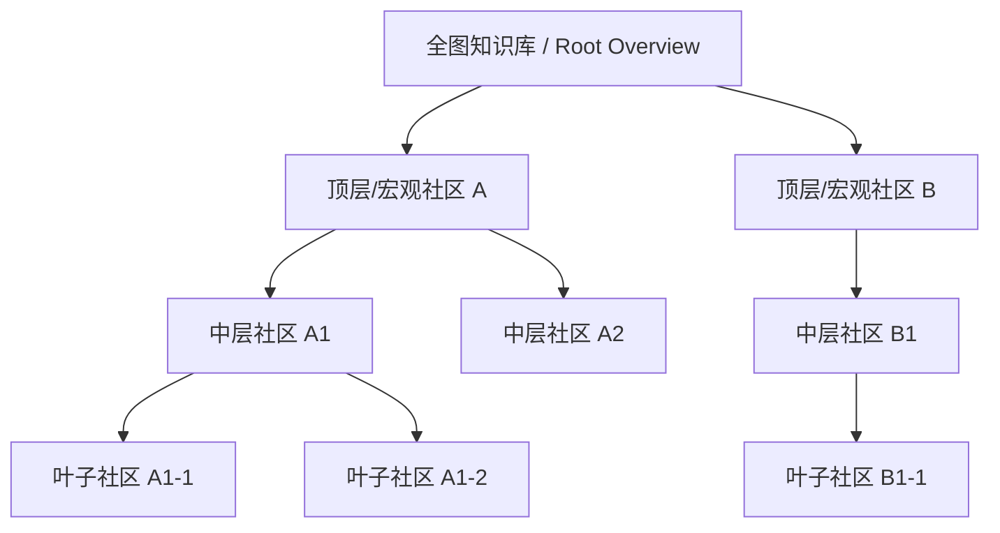
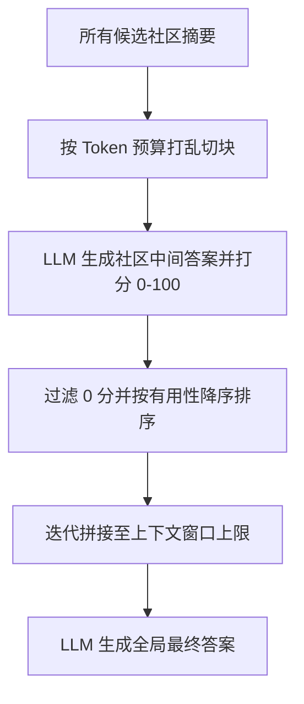
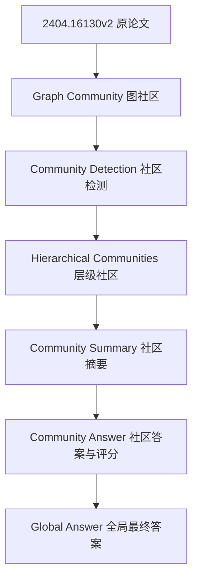

# GraphRAG 里的“社区”概念

> 💡 **论文解读与参考来源**：本文内容基于对微软论文 [*From Local to Global: A Graph RAG Approach to Query-Focused Summarization*](https://arxiv.org/abs/2404.16130) (arXiv:2404.16130) 的深入研读、工程实践与架构解读。

---

## 1. 先说结论

在这篇论文里，“社区”不是社交网络里的“用户圈子”，而是一个图结构中的“高内聚子图”——也就是：

- 图中一组相互关联、语义相关、结构紧密的节点
- 这些节点之间的连接强于和外部节点之间的连接
- 在 GraphRAG 中，它用于把全局知识图拆成若干个可管理的主题分区

简单说：社区 = “一个图中的主题簇/模块/子图”。

---

## 2. 它来自哪里

论文在 GraphRAG 的流程里，先把文档抽取成知识图谱：

- 节点：实体（人、组织、地点、事件、概念等）
- 边：实体之间的关系
- 断言/声明：关于实体或关系的事实描述

然后，GraphRAG 进一步对这个知识图做“社区检测”（community detection）。

也就是说：

> 基于图的连接结构，把相互靠近、语义上下文相似的实体分组成一个个社区。

这一步对应论文中的：

- “知识图谱 → 图社区”
- 使用 Leiden 等社区检测算法
- 递归地检测内部子社区，形成层级结构

---

## 3. 社区在 GraphRAG 里的具体含义

### 3.1 结构上的含义

一个社区可以理解为一组“紧密相连”的节点集合，具有这样的特点：

- 内部连接比较密集
- 与外部连接相对稀疏
- 往往对应某一主题、领域、事件簇或语义模块

例如在新闻、企业、科研、政府等语料库中，一个社区可能对应：

- 某个企业的产品线
- 某个地区的政治事件
- 某个研究主题的关键人物和方法
- 某个领域中的关键概念和事实网络

### 3.2 语义上的含义

社区并不只是网络拓扑上的“簇”，它还承载语义信息。因为节点和边都来自文档抽取，所以社区也同时代表：

- 主题的聚集
- 事实的集合
- 事件关联的子网络
- 领域内的上下文容器

因此，社区可以被看成：

> 一个“知识模块”或“主题单元”，它是全局语料库的一部分。

---

## 4. 为什么 GraphRAG 需要社区

GraphRAG 的目标不是只检索单个事实，而是回答“全局意义构建”问题。比如：

- 整个语料库里主要发生了什么？
- 关键议题和观点有哪些？
- 哪些实体、事件、趋势相互关联？
- 这个领域的整体结构是什么？

如果直接面对整个大图，模型很难一次性理解所有信息。于是 GraphRAG 把大图拆成多个社区，再在社区内部做摘要，最后在社区之间做合并与整合。

这使得系统具备以下优点：

- 分而治之：大规模图不再“一次性喂给模型”
- 结构化组织：知识按主题划分、层级化管理
- 可扩展：社区可以继续递归细分，形成层次结构
- 更容易摘要：每个社区可以生成独立摘要，再聚合成全局答案

---

## 5. 社区是如何形成的

论文中的流程是：

1. 先从文档中抽取实体、关系、声明
2. 形成知识图谱
3. 对知识图执行社区检测
4. 将图分成互斥且覆盖全图的社区
5. 对每个社区生成摘要
6. 之后在查询阶段，利用社区摘要回答问题

### 5.1 层级社区结构

论文强调：社区检测不是只做一层，而是递归地做。也就是：

- 先在大图上做第一轮社区检测
- 每个社区再继续细分为子社区
- 直到无法继续分割，形成一个层级树结构

这种结构很关键，因为它提供了不同粒度的知识视角：

- 顶层社区：大主题、全局大框架
- 中层社区：中等规模主题
- 叶子社区：更具体的子主题、局部事实群

因此，社区不是一维的，而是一个“层次化主题地图”。



---

## 6. 社区摘要是怎么用的

社区的价值不只是“分组”，而是在于每个社区都可以生成一段摘要。论文中的“社区摘要”是关键中间产物。

### 6.1 叶子社区摘要

对于最底层社区，摘要通常聚合：

- 边
- 节点描述
- 相关声明
- 相关实体和关系信息

### 6.2 高层社区摘要

高层社区的摘要则可以基于下层社区摘要继续生成：

- 下层社区更细、更具体
- 上层社区更宏观、主题更广
- 这样形成层级化写作结构

这意味着：

> 社区以后不是“只为了切图”，而是为检索和生成准备的主题摘要单元。

---

## 7. 查询时，社区如何帮助回答问题

论文中“社区摘要 → 社区答案 → 全球答案”是核心流程：



### 7.1 先准备社区摘要

若用户查询某个主题，系统会取出相关社区摘要，并把它们随机打乱、切块处理。

这样做的目的是：

- 避免相关信息都集中在一个上下文中
- 把信息分散到多个块，保证更均匀地参与生成

### 7.2 再让 LLM 为各社区生成中间答案

对每个社区摘要，LLM 会回答：

- 这个社区对该查询有没有帮助？
- 它能给出什么观点、结论、证据？

同时，LLM 要给出一个分数（0~100），表示该答案对回答目标问题的帮助程度。

### 7.3 排序和过滤

- 评分为 0 的答案直接过滤
- 其余答案按打分降序排序
- 迭代加入最终上下文，直到达到 token 上限

### 7.4 最后生成全局答案

最终只保留最有帮助的社区答案，合并成一个系统最终输出。

这说明：

> 社区在查询阶段不是被当成一个静态标签，而是成为“候选证据单元”，最终被筛选和整合成答案。

---

## 7.5 伪代码与概念关联（Obsidian 版）

> [!note] 关联视角
> [[graphRAG-community-concept]] 是对 [[2404.16130v2_zh]] 中“知识图谱 → 图社区 → 社区摘要 → 社区答案 → 全球答案”流程的概念化解释。
> 
> - [[2404.16130v2_zh]]：原论文主文档
> - [[graphRAG-community-concept]]：社区定义与语义解释
> - `Graph community`：图社区检测的核心对象
> - `Community summary`：社区摘要
> - `Community answer`：社区中间答案
> - `Global answer`：最终全局答案

```ts
// 关联关系：
// 文档 -> 知识图谱 -> 社区检测 -> 社区摘要 -> 社区答案 -> 全局答案

type CommunitySummary = {
  communityId: string;
  level: number;
  content: string;
};

type CommunityView = {
  communityId: string;
  answer: string;
  score: number; // 0~100
};

async function generateGlobalAnswer(
  query: string,
  communities: CommunitySummary[]
): Promise<string> {
  // 1) 社区切片：把社区摘要按 token 切块
  const chunks = sliceCommunities(communities, 1200);

  // 2) 对每个社区切片生成中间答案，并打分
  const candidates: CommunityView[] = [];
  for (const chunk of chunks) {
    const view = await generateCommunityView(query, chunk);
    if (view && view.score > 0) {
      candidates.push(view);
    }
  }

  // 3) 排序过滤：按分数降序，保留高价值观点
  const ranked = candidates
    .sort((a, b) => b.score - a.score)
    .filter(v => v.score >= 1);

  // 4) 迭代拼接到最终上下文，直到不超 token 上限
  let finalContext = "";
  for (const item of ranked) {
    if (estimateTokens(finalContext + item.answer) > 8192) break;
    finalContext += item.answer + "\n\n";
  }

  // 5) 生成最终全局答案
  return await llmAnswer(query, finalContext);
}

function sliceCommunities(
  communities: CommunitySummary[],
  chunkSize: number
): CommunitySummary[][] {
  const shuffled = shuffle(communities);
  const result: CommunitySummary[][] = [];
  let bucket: CommunitySummary[] = [];
  let tokens = 0;

  for (const c of shuffled) {
    const cTokens = estimateTokens(c.content);
    if (bucket.length && tokens + cTokens > chunkSize) {
      result.push(bucket);
      bucket = [];
      tokens = 0;
    }
    bucket.push(c);
    tokens += cTokens;
  }

  if (bucket.length) result.push(bucket);
  return result;
}

async function generateCommunityView(
  query: string,
  chunk: CommunitySummary[]
): Promise<CommunityView | null> {
  const text = chunk.map(c => c.content).join("\n\n");
  const prompt = `
    用户问题: ${query}
    社区摘要:
    ${text}
    你需要：
    1) 给出一个对问题有帮助的中间答案
    2) 输出 0~100 的帮助分数
  `;

  const raw = await llmCall(prompt);
  const parsed = JSON.parse(raw);
  const answer = String(parsed.answer ?? "").trim();
  const score = Number(parsed.score ?? 0);

  if (!answer || score <= 0) return null;

  return {
    communityId: chunk.map(c => c.communityId).join(","),
    answer,
    score,
  };
}

async function llmAnswer(query: string, context: string): Promise<string> {
  return await llmCall(`
    问题: ${query}
    参考信息:
    ${context}
  `);
}
```

### 概念关系（Obsidian / Mermaid 关系图）



这段伪代码本质上就是把论文中的这条链路写成了工程化表达：

- 先把大图拆成多个社区
- 再为每个社区生成摘要
- 对每个摘要生成有用性评分
- 按分数排序与过滤
- 最终在上下文窗口内合成答案

它与论文中的核心思想一一对应：

- `community detection` = 社区检测
- `community summary` = 社区摘要
- `community answer` = 社区答案
- `global answer` = 全局答案

---

## 8. 一个非常直观的理解

可以把 GraphRAG 的社区理解成：

- 不是“一个社交群体”
- 而是“一个主题磁场”
- 它把大量知识按关联度和语义相近性归并
- 然后让模型先看局部，再看整体

如果把整个知识库看成一张巨大的城市地图，那么社区就是：

- 一个商业区
- 一个学术区
- 一个事件区
- 一个产业链区

每个区有自己的主题、节点、关系和摘要，而最终的答案就是从这些区中筛选最有价值的信息重组出来。

---

## 9. 一句话总结

在 GraphRAG 中，“社区”指的是：

> 通过社区检测算法把知识图拆分成若干个紧密连接、语义相近、可独立总结的主题模块；这些社区被抽象成社区摘要，随后在查询阶段用于生成中间答案并最终聚合出全局答案。

它是 GraphRAG 从“检索单条事实”走向“理解整个知识库结构”的关键抽象层。

