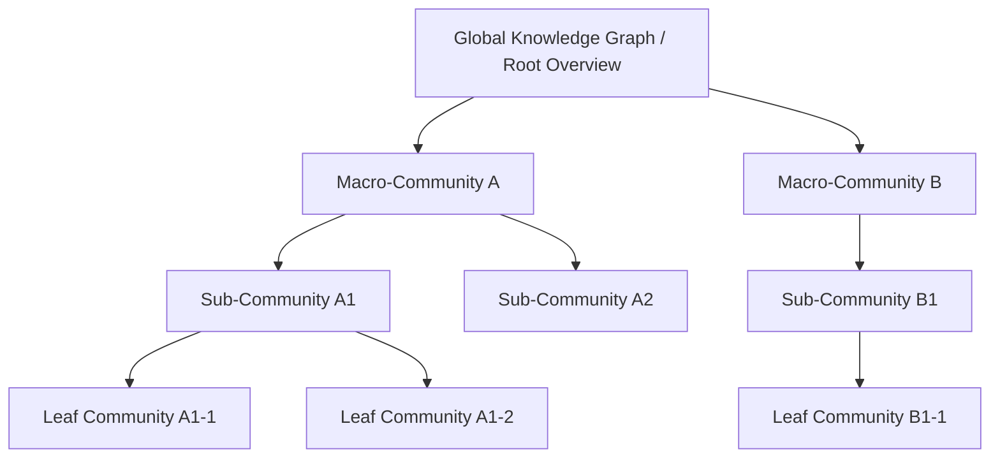
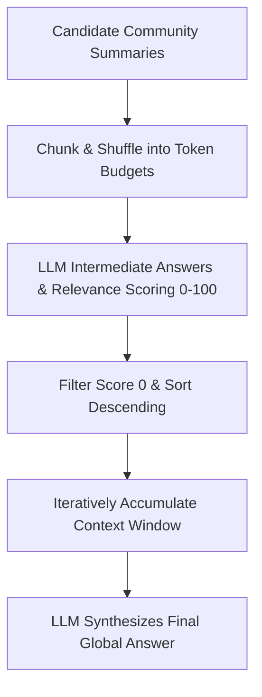
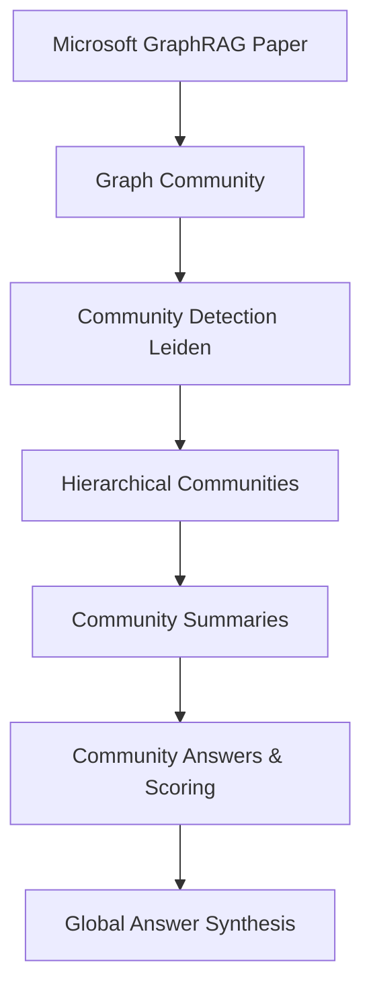

# Understanding the Community Concept in GraphRAG

> 💡 **Paper Reference & Attribution**: This article is derived from an in-depth study, engineering analysis, and architectural interpretation of the Microsoft research paper [*From Local to Global: A Graph RAG Approach to Query-Focused Summarization*](https://arxiv.org/abs/2404.16130) (arXiv:2404.16130).

---

## 1. Executive Summary

In Microsoft's GraphRAG paper, a "Community" does not refer to a social user circle. Rather, it denotes a **densely connected subgraph (cohesive node cluster)** within a knowledge graph:

- A collection of interconnected, semantically related, and structurally dense entities.
- The density of edges connecting nodes inside the community is substantially higher than connections to external nodes.
- In GraphRAG, communities partition the vast global knowledge graph into manageable, topic-driven semantic modules.

In short: **Community = A cohesive thematic cluster / knowledge module / subgraph partition.**

---

## 2. Where Do Communities Come From?

In the GraphRAG indexing pipeline, raw documents are first transformed into an extracted knowledge graph:

- **Nodes**: Entities (people, organizations, locations, events, concepts).
- **Edges**: Relationships linking entity pairs.
- **Claims / Covariates**: Factual statements and assertions anchored to entities/relationships.

Next, GraphRAG applies **Community Detection Algorithms** (such as the Leiden algorithm) over the weighted graph:

> Based on the connectivity and edge weights of the graph, entities with high structural cohesion and shared semantic context are partitioned into hierarchical communities.

---

## 3. The Dual Nature of Communities in GraphRAG

### 3.1 Structural Dimension
From a graph topology perspective, a community exhibits:
- High internal link density.
- Relatively sparse inter-community bridges.
- Alignment with functional clusters: product ecosystems, geopolitical events, specialized research methods, or organizational hierarchies.

### 3.2 Semantic Dimension
Because nodes and edges are extracted from contextual text chunks, a community naturally represents:
- A thematic focal point.
- An aggregation of related factual claims.
- A scoped context container for complex reasoning.

---

## 4. Why GraphRAG Requires Communities

Traditional RAG retrieves isolated chunks, making it difficult to answer global "sensemaking" queries such as:
- *"What are the primary themes across this entire corpus?"*
- *"What key trends, risks, and viewpoints emerge from the documents?"*

Feeding the entire graph or corpus directly into an LLM exceeds context limits and introduces noise. By clustering the graph into hierarchical communities:
- **Divide and Conquer**: Large graphs are segmented into independently digestible modules.
- **Hierarchical Summarization**: Executive summaries can be generated per community and aggregated upwards.
- **Global Answer Synthesis**: Queries evaluate community summaries in parallel to assemble holistic responses.

---

## 5. Hierarchical Community Structures

GraphRAG builds a multi-level community tree through recursive clustering:

- **Root / Top-Level Communities**: High-level macro topics and comprehensive domain frameworks.
- **Intermediate Communities**: Mid-tier sub-themes and connected event tracks.
- **Leaf Communities**: Highly localized entity clusters and specific factual networks.



---

## 6. How Community Summaries Power Query Answering



```ts
type CommunitySummary = {
  communityId: string;
  level: number;
  content: string;
};

type CommunityView = {
  communityId: string;
  answer: string;
  score: number; // 0 to 100
};

async function generateGlobalAnswer(
  query: string,
  communities: CommunitySummary[]
): Promise<string> {
  // 1) Chunk communities: distribute community summaries into token-budgeted slices
  const chunks = sliceCommunities(communities, 1200);

  // 2) Generate intermediate candidate answers and score helpfulness
  const candidates: CommunityView[] = [];
  for (const chunk of chunks) {
    const view = await generateCommunityView(query, chunk);
    if (view && view.score > 0) {
      candidates.push(view);
    }
  }

  // 3) Filter & Rank: sort by helpfulness score descending
  const ranked = candidates
    .sort((a, b) => b.score - a.score)
    .filter(v => v.score >= 1);

  // 4) Concatenate top answers within the context window limit
  let finalContext = "";
  for (const item of ranked) {
    if (estimateTokens(finalContext + item.answer) > 8192) break;
    finalContext += item.answer + "\n\n";
  }

  // 5) Synthesize final response
  return await llmAnswer(query, finalContext);
}

function sliceCommunities(
  communities: CommunitySummary[],
  chunkSize: number
): CommunitySummary[][] {
  const shuffled = shuffle(communities);
  const result: CommunitySummary[][] = [];
  let bucket: CommunitySummary[] = [];
  let tokens = 0;

  for (const c of shuffled) {
    const cTokens = estimateTokens(c.content);
    if (bucket.length && tokens + cTokens > chunkSize) {
      result.push(bucket);
      bucket = [];
      tokens = 0;
    }
    bucket.push(c);
    tokens += cTokens;
  }

  if (bucket.length) result.push(bucket);
  return result;
}

async function generateCommunityView(
  query: string,
  chunk: CommunitySummary[]
): Promise<CommunityView | null> {
  const text = chunk.map(c => c.content).join("\n\n");
  const prompt = `
    User Query: ${query}
    Community Summaries:
    ${text}

    Instructions:
    1) Provide a concise intermediate answer to the query based strictly on the provided summaries.
    2) Provide a helpfulness score (0-100) indicating how useful this context is for answering the target query.
  `;

  const raw = await llmCall(prompt);
  const parsed = JSON.parse(raw);
  const answer = String(parsed.answer ?? "").trim();
  const score = Number(parsed.score ?? 0);

  if (!answer || score <= 0) return null;

  return {
    communityId: chunk.map(c => c.communityId).join(","),
    answer,
    score,
  };
}

async function llmAnswer(query: string, context: string): Promise<string> {
  return await llmCall(`
    Query: ${query}
    Context Information:
    ${context}
  `);
}
```

---

## 7. Summary & Conceptual Mapping



| Concept | Description |
|:---|:---|
| **Graph Community** | A high-cohesion subgraph generated via clustering algorithms (e.g., Leiden). |
| **Hierarchical Structure** | Multi-level tree partition offering varying granularities of domain knowledge. |
| **Community Summary** | Pre-generated executive synthesis capturing nodes, relations, and claims per partition. |
| **Community Answer** | Scored candidate response evaluating relevance to a user query. |
| **Global Answer** | Comprehensive synthesis combining high-scoring community perspectives. |
